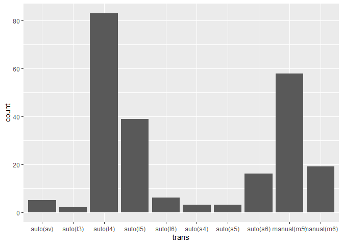
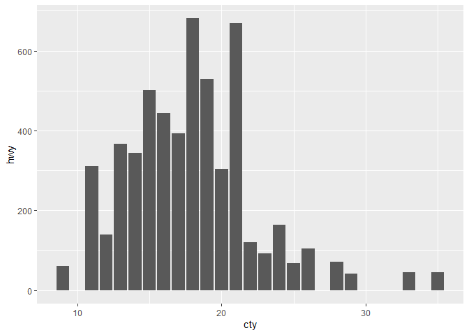
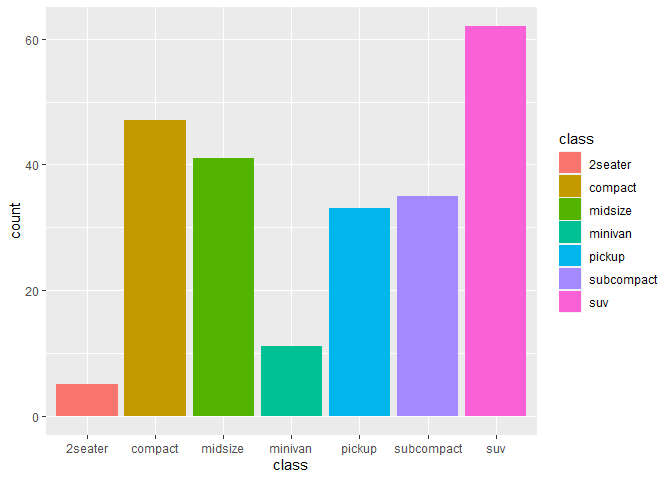
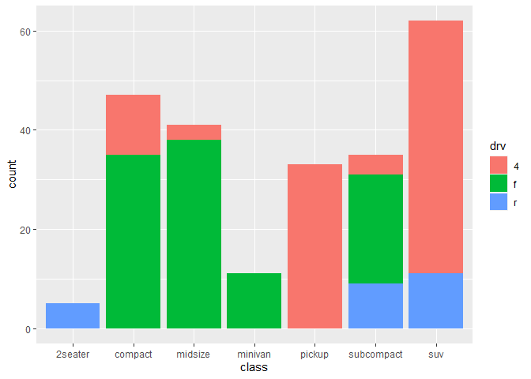
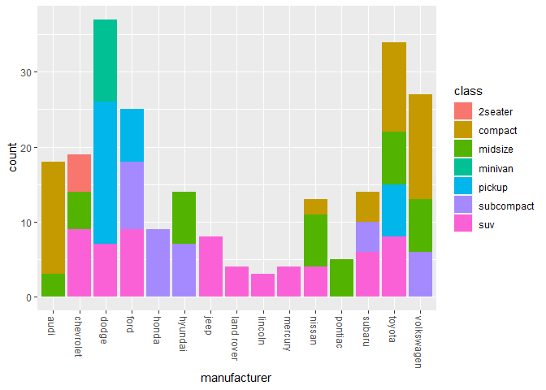
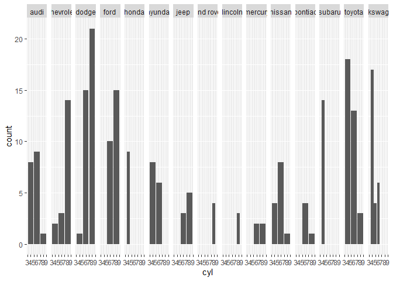

Visualization: Bar Charts
================
Zach del Rosario
2020-05-13

*Purpose*: *Bar charts* are a key tool for EDA. In this exercise, we’ll
learn how to construct a variety of different bar charts, as well as
when—and when *not*—to use various charts.

*Reading*: [Bar Charts](https://rstudio.cloud/learn/primers/3.2)
*Topics*: (All topics) *Reading Time*: \~30 minutes

``` r
library(tidyverse)
```

    ## -- Attaching packages --------------------------------------- tidyverse 1.3.0 --

    ## v ggplot2 3.3.2     v purrr   0.3.4
    ## v tibble  3.0.1     v dplyr   1.0.0
    ## v tidyr   1.1.0     v stringr 1.4.0
    ## v readr   1.3.1     v forcats 0.5.0

    ## -- Conflicts ------------------------------------------ tidyverse_conflicts() --
    ## x dplyr::filter() masks stats::filter()
    ## x dplyr::lag()    masks stats::lag()

**q1** In the reading, you learned the relation between `geom_bar()` and
`geom_col()`. Use that knowledge to convert the following `geom_bar()`
plot into the same visual using `geom_col()`.

``` r
mpg %>%
  ggplot(aes(trans)) +
  geom_bar()
```

<!-- -->

The reading mentioned that when using `geom_col()` our x-y data should
be `1-to-1`. This next exercise will probe what happens when our data
are not `1-to-1`, and yet we use a `geom_col()`. Note that a
[one-to-one](https://en.wikipedia.org/wiki/Injective_function) function
is one where each input leads to a single output. For the `mpg` dataset,
we can see that the pairs `cty, hwy` clearly don’t have this one-to-one
property:

``` r
## NOTE: Run this chunk for an illustration
mpg %>% filter(cty == 20)
```

    ## # A tibble: 11 x 11
    ##    manufacturer model    displ  year   cyl trans  drv     cty   hwy fl    class 
    ##    <chr>        <chr>    <dbl> <int> <int> <chr>  <chr> <int> <int> <chr> <chr> 
    ##  1 audi         a4         2    2008     4 manua~ f        20    31 p     compa~
    ##  2 audi         a4 quat~   2    2008     4 manua~ 4        20    28 p     compa~
    ##  3 hyundai      tiburon    2    2008     4 manua~ f        20    28 r     subco~
    ##  4 hyundai      tiburon    2    2008     4 auto(~ f        20    27 r     subco~
    ##  5 subaru       foreste~   2.5  2008     4 manua~ 4        20    27 r     suv   
    ##  6 subaru       foreste~   2.5  2008     4 auto(~ 4        20    26 r     suv   
    ##  7 subaru       impreza~   2.5  2008     4 auto(~ 4        20    25 p     compa~
    ##  8 subaru       impreza~   2.5  2008     4 auto(~ 4        20    27 r     compa~
    ##  9 subaru       impreza~   2.5  2008     4 manua~ 4        20    27 r     compa~
    ## 10 volkswagen   new bee~   2.5  2008     5 manua~ f        20    28 r     subco~
    ## 11 volkswagen   new bee~   2.5  2008     5 auto(~ f        20    29 r     subco~

**q2** The following code attempts to visualize `cty, hwy` from `mpg`
using `geom_col()`. There’s something fishy about the `hwy` values;
what’s wrong here?

*Hint*: Try changing the `position` parameter for `geom_col()`.

``` r
mpg %>%
  ggplot(aes(x = cty, y = hwy)) +
  geom_col()
```

<!-- -->

**Observations**: - Write your observations here\!

A more standard way to visualize this kind of data is a *scatterplot*,
which we’ll study later. For now, here’s an example of a more effective
way to visualize `cty` vs `hwy`:

``` r
## NOTE: Run this chunk for an illustration
mpg %>%
  ggplot(aes(cty, hwy)) +
  geom_point()
```

<!-- -->

**q3** The following are two different visualizations of the `mpg`
dataset. Document your observations between the `v1` and `v2` visuals.
Then, determine which—`v1` or `v2`—enabled you to make more
observations. What was the difference between the two visuals?

``` r
## TODO: Run this code without changing, describe your observations on the data
mpg %>%
  ggplot(aes(class, fill = class)) +
  geom_bar()
```

<!-- -->

**Observations**: - Write your observations here\!

``` r
## TODO: Run this code without changing, describe your observations on the data
mpg %>%
  ggplot(aes(class, fill = drv)) +
  geom_bar()
```

<!-- -->

**Observations**: - Write your observations here\!

**Compare `v1` and `v2`**:

  - Which visualization—`v1` or `v2`—enabled you to make more
    observations?
  - What was the difference between `v1` and `v2`?

**q4** The following code has a bug; it does not do what its author
intended. Identify and fix the bug. What does the resulting graph tell
you about the relation between `manufacturer` and `class` of cars in
this dataset?

*Note*: I use a `theme()` call to rotate the x-axis labels. We’ll learn
how to do this in a future exercise.

``` r
mpg %>%
  ggplot(aes(x = manufacturer, fill = class), position = "dodge") +
  geom_bar() +
  theme(axis.text.x = element_text(angle = 270, vjust = 0.5, hjust = 0))
```

<!-- -->

**Observations** - Your observations here\!

**q5** The following graph is hard to read. What other form of faceting
would make the visual more convenient to read? Modify the code below
with your suggested improvement.

``` r
mpg %>%
  ggplot(aes(x = cyl)) +
  geom_bar() +
  facet_grid(~ manufacturer)
```

<!-- -->

<!-- include-exit-ticket -->

# Exit Ticket

<!-- -------------------------------------------------- -->

Once you have completed this exercise, make sure to fill out the **exit
ticket survey**, [linked
here](https://docs.google.com/forms/d/e/1FAIpQLSeuq2LFIwWcm05e8-JU84A3irdEL7JkXhMq5Xtoalib36LFHw/viewform?usp=pp_url&entry.693978880=e-vis01-bar-charts-assignment.Rmd).
